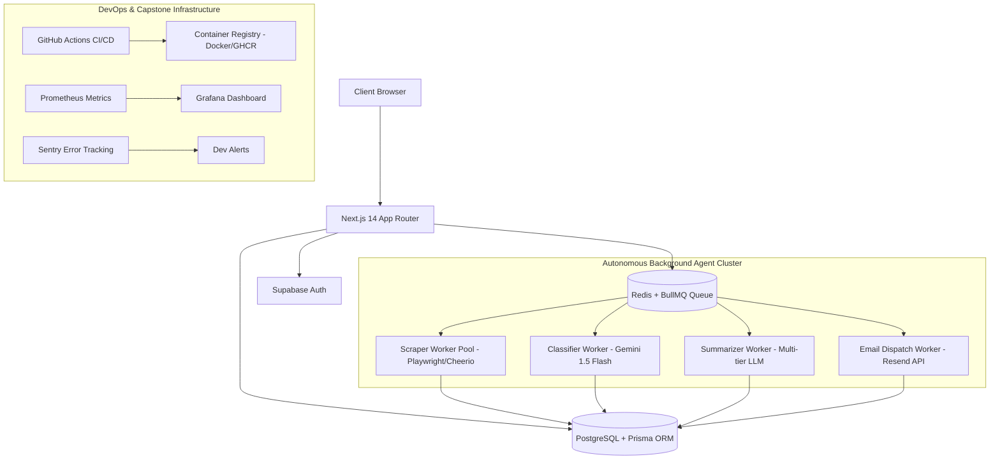
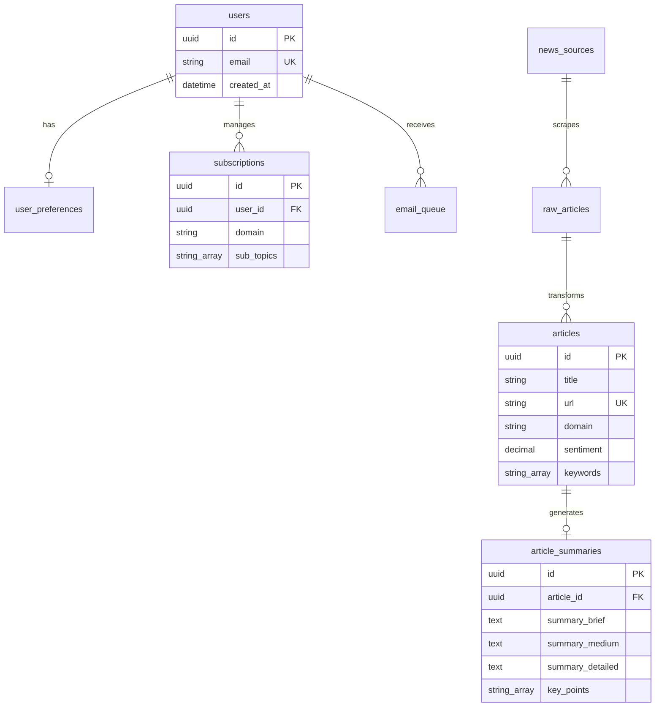

# AI News Digest - Complete Project Overview & Scalable Capstone Architecture

Complete documentation index and scalability guide for your AI-powered news aggregation and summarization platform.

---

## 📑 Documentation Index

This repository includes **8 comprehensive workflow guides**:

1. **sprint-roadmap.md** (Sprint Timeline & Scalability Roadmap)
   - 4-week daily tracker, phase milestones, and Phase 5 Capstone architecture.
2. **ai-news-digest-plan-jsx.md** (Main Architecture & Vision)
   - Core architecture, technology choices, database design, and agent pipelines.
3. **implementation-guide-jsx.md** (Code & Service Setup)
   - Step-by-step installation, Supabase, Gemini, Redis, and Resend setup.
4. **ui-components-jsx.md** (Frontend Component System)
   - Landing page, dashboard portal, sub-views, and glassmorphism dark theme.
5. **api-routes-jsx.md** (Backend APIs & Middleware)
   - REST endpoints, server actions, authentication middleware, and seed scripts.
6. **utilities-config-jsx.md** (Tools & Configuration)
   - Error handling, rate limiting, logging, caching, and Tailwind configs.
7. **complete-getting-started-jsx.md** (Getting Started)
   - Quickstart guide for setting up environment variables and running locally.
8. **PROJECT-OVERVIEW.md** (This Document)
   - High-level system overview, technology stack, and engineering capstone strategy.

---

## 🏛️ System Architecture

---

## 🚀 Capstone Transition Strategy & Engineering Technologies

To elevate **AI News Digest** into an enterprise-grade capstone project capable of supporting thousands of concurrent multi-tenant users, the following core infrastructure layers are integrated:

### 1. Multi-Container Docker & Docker Compose
- **Web Service (`web`)**: Next.js 14 frontend and serverless API endpoints.
- **Redis Service (`redis`)**: In-memory data store for caching and task queues.
- **Worker Cluster (`worker`)**: Isolated Node.js worker containers processing long-running scraping and LLM jobs.
- **Database (`postgres`)**: PostgreSQL database with PgBouncer connection pooling.

### 2. Distributed Task Queuing with Redis & BullMQ
- **Asynchronous Execution**: Moves Playwright browser scraping and Gemini API calls out of HTTP request lifecycles into dedicated background queue workers.
- **Distributed Locking (`Redlock`)**: Prevents race conditions during feed ingestion and cron triggers.
- **Retry Management**: Exponential backoff retry policies and Dead-Letter Queues (DLQ) for failed scrapers.

### 3. CI/CD Pipeline with GitHub Actions
- **Automated Validation**: Runs linting (`ESLint`), type checking, unit tests (`Jest`), and end-to-end user flow tests (`Playwright`).
- **Container Registry Push**: Builds production Docker images and publishes to GitHub Container Registry (GHCR) or AWS ECR.

### 4. Enterprise Observability & Monitoring
- **Prometheus Exporter**: Metrics for queue depth, worker throughput, Gemini token usage, and HTTP status codes.
- **Grafana Dashboards**: Real-time visual monitoring of system health and scraper performance.
- **Sentry Integration**: Automated stack trace collection and error alerts for LLM exceptions.

---

## 📊 Database Schema Entity Map

