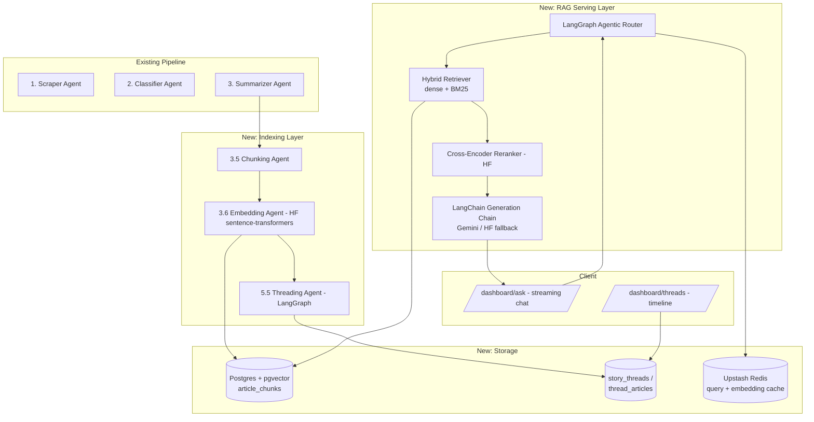
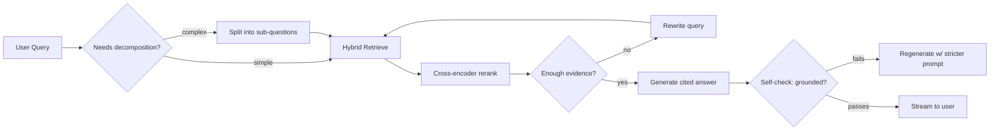

# 🧠 SwiftIQ RAG Layer — Scalable Architecture & Migration Plan

> **Companion Document to**: `workflow/ARCHITECTURE_AND_WORKFLOW.md`
> **Scope**: Adds a Retrieval-Augmented Generation layer (semantic search, story-threading, conversational research assistant) on top of the existing 5-stage pipeline, and gives a phased conversion path from the current system.

---

## 🎯 1. What This Adds, and Why It's Scalable

The current pipeline produces isolated per-article summaries. This layer adds a **persistent, queryable knowledge base** over everything SwiftIQ has ever ingested, so users can:

- Ask natural-language questions across the whole corpus ("what's happened with semiconductor export bans this week?") and get a cited, synthesized answer.
- See **story threads** — how a single event evolved across sources and days — instead of flat article lists.
- Get this at scale: the design below is meant to hold up from "a few thousand articles" to "tens of millions," not just work in a demo.

Three scaling principles drive every decision here:
1. **Chunk-level, not article-level, retrieval** — precision at scale requires small units, not whole articles.
2. **Approximate Nearest Neighbor (ANN) indexing**, not brute-force cosine search — required past ~100k vectors.
3. **Cache and pre-compute aggressively** — embeddings, retrieval results, and even generations are expensive; recomputation should be the exception, not the default.

---

## 🏛️ 2. High-Level Architecture



---

## 🔍 3. Retrieval Pipeline (the core of "scalable RAG")

### 3.1 Chunking strategy
News articles are short relative to books/PDFs, so chunking is lighter-weight but still matters for precision:

- **`summary_brief` / `summary_medium`**: embed as a single chunk each (they're already dense).
- **`summary_detailed`**: split into ~300–500 token chunks with ~15% overlap (`RecursiveCharacterTextSplitter` from LangChain — don't hand-roll this).
- Every chunk stores a back-reference to `article_id` so retrieval can always resolve to a citable source.

```prisma
model ArticleChunk {
  id          String   @id @default(uuid())
  articleId   String
  article     Article  @relation(fields: [articleId], references: [id])
  content     String   @db.Text
  chunkIndex  Int
  tokenCount  Int
  embedding   Unsupported("vector(384)")
  sourceTier  String   // "brief" | "medium" | "detailed"
  createdAt   DateTime @default(now())

  @@index([articleId])
}
```

### 3.2 Embedding model choice
- **`sentence-transformers/all-MiniLM-L6-v2`** (384-dim) or **`BAAI/bge-small-en-v1.5`** — small enough to run cheaply, good enough for news-domain retrieval.
- Run via `@xenova/transformers` (transformers.js) **in-process in Node** — no separate Python service needed, stays in your existing stack. If you outgrow that, swap for the HF Inference API with batching, or a small FastAPI sidecar — same interface either way, so this is a drop-in swap later, not a rewrite.
- Batch embedding calls (32–64 chunks per call) inside the Embedding Agent; never embed one chunk per request at scale.

### 3.3 Vector index (this is the part that actually determines whether it scales)
```sql
CREATE EXTENSION IF NOT EXISTS vector;

-- HNSW, not IVFFlat: better recall/latency at your scale, no need to retrain as data grows
CREATE INDEX article_chunk_embedding_idx
  ON "ArticleChunk"
  USING hnsw (embedding vector_cosine_ops)
  WITH (m = 16, ef_construction = 64);
```
- **HNSW over IVFFlat**: IVFFlat needs periodic re-clustering as data grows (bad fit for a continuously-ingesting news pipeline); HNSW degrades gracefully and supports incremental inserts.
- **Partition by time** once you're past a few million chunks: e.g. a `article_chunks_recent` (last 90 days, hot index) vs `article_chunks_archive` split, since news queries skew heavily recent. Query recent first, fall back to archive only if needed — this alone is a big latency/cost win.
- Set `ef_search` per-query: lower for interactive chat (fast), higher for background digest-relevance scoring (accurate).

### 3.4 Hybrid retrieval, not pure vector search
Pure dense retrieval misses exact entity/ticker/name matches (e.g. "NVDA" vs "Nvidia"). Combine:
- **Dense**: pgvector cosine similarity, top-k=25.
- **Sparse**: Postgres full-text search (`tsvector`) on the same chunks, top-k=25.
- **Fuse**: Reciprocal Rank Fusion (RRF) to merge the two ranked lists — cheap, no extra model needed.
- **Rerank**: cross-encoder (`cross-encoder/ms-marco-MiniLM-L-6-v2` via HF) on the fused top-25 → final top-5–8 passed to the LLM. This is the step that most improves answer quality per dollar and is a genuine HF integration point beyond "just embeddings."

### 3.5 Generation + citation
- LangChain retrieval chain with a strict prompt: answer only from provided chunks, cite `article_id` inline, refuse (state "not enough recent coverage") rather than hallucinate if retrieval confidence is low.
- Stream the response to the client (Vercel AI SDK `streamText`, LangChain is fully compatible).

---

## 🕸️ 4. Agentic Orchestration — LangGraph

Two separate graphs, not one — keep ingestion and serving independently scalable.

### 4.1 Ingestion graph (batch, cron-triggered — extends your existing pipeline)
```
Scraper → Classifier → Summarizer → Chunker → Embedder → Threader → Digest/Dispatch
                                                    │
                                          (existing stages unchanged)
```
The Threading Agent runs vector similarity search against **recent** embeddings only (e.g. last 14 days) to decide: new thread, append to existing thread, or standalone. Store the relation type:

```prisma
model StoryThread {
  id          String   @id @default(uuid())
  title       String
  domain      String
  summary     String   @db.Text   // rolling narrative summary, regenerated as threads grow
  articles    ThreadArticle[]
  createdAt   DateTime @default(now())
  updatedAt   DateTime @updatedAt
}

model ThreadArticle {
  id           String      @id @default(uuid())
  threadId     String
  thread       StoryThread @relation(fields: [threadId], references: [id])
  articleId    String
  article      Article     @relation(fields: [articleId], references: [id])
  relationType String      // "same_story" | "follow_up" | "contradicts"
  similarity   Float
}
```

### 4.2 Query-time graph (interactive, low-latency — this is the "Ask SwiftIQ" agent)

This "retrieve → grade → rewrite-if-needed → generate → self-check" loop is the standard **Corrective/Self-RAG** pattern, and LangGraph is exactly the tool for it — it's a cycle, not a linear chain, which is precisely what LangChain alone doesn't model well.

- Persist conversation state via `conversations` / `messages` tables so multi-turn context survives across requests (LangGraph checkpointer backed by Postgres — reuse your existing DB, no new infra):

```prisma
model Conversation {
  id        String    @id @default(uuid())
  userId    String
  user      User      @relation(fields: [userId], references: [id])
  messages  Message[]
  createdAt DateTime  @default(now())
}

model Message {
  id             String       @id @default(uuid())
  conversationId String
  conversation   Conversation @relation(fields: [conversationId], references: [id])
  role           String       // "user" | "assistant"
  content        String       @db.Text
  citedArticles  String[]     // article ids referenced in this answer
  createdAt      DateTime     @default(now())
}
```

---

## ⚡ 5. Caching & Cost Control (Upstash Redis — already in your stack)

| Cache | Key | TTL | Why |
|---|---|---|---|
| Embedding cache | hash(chunk text) → vector | ∞ (content-addressed) | Never re-embed identical text (common with wire-service syndication) |
| Retrieval cache | hash(query + filters) → chunk ids | 5–15 min | News queries cluster around trending topics; huge hit rate during breaking news |
| Full response cache | hash(query) → streamed answer | 5 min | Avoid re-running the whole graph for identical trending questions across users |
| Rate limit | per-user token budget | rolling window | You already use QStash/Redis for rate-limiting — extend the same pattern to LLM spend |

---

## 📡 6. New API Surface

| Endpoint | Method | Purpose |
|---|---|---|
| `/api/rag/query` | POST | Non-streaming Q&A (used by mobile/simple clients) |
| `/api/rag/stream` | POST | SSE/streaming chat, backs `/dashboard/ask` |
| `/api/rag/conversations` | GET/POST | List/create conversation threads |
| `/api/threads` | GET | List story threads, filterable by domain/date |
| `/api/threads/[id]` | GET | Single thread timeline with member articles |
| `/api/cron/embed` | POST/GET | Trigger Chunking + Embedding agents |
| `/api/cron/thread` | POST/GET | Trigger Threading agent |

---

## 🔄 7. Migration Plan — Phased Conversion from the Current System

Each phase is independently shippable and testable; nothing requires a big-bang rewrite.

| Phase | What ships | Touches existing system? |
|---|---|---|
| **1. Foundations** | Enable `pgvector` extension; add `ArticleChunk` table; write Chunking + Embedding Agent as a new cron stage after Summarizer | Additive only — no existing table/route changes |
| **2. Retrieval core** | Hybrid retriever (dense + `tsvector`) + HNSW index + RRF fusion; internal-only, no UI yet | None — new module, tested via script/CLI |
| **3. LangChain refactor** | Replace raw Gemini SDK calls in Classifier/Summarizer with LangChain structured output; add cross-encoder reranker | Refactors existing agents in place, same DB writes, same outputs — safe to A/B against current output |
| **4. Query-time LangGraph agent** | Build the retrieve→grade→generate→critique graph; expose via `/api/rag/query` (no streaming yet) | New routes only |
| **5. Conversational UI** | `Conversation`/`Message` tables, Postgres-backed LangGraph checkpointer, `/api/rag/stream`, `/dashboard/ask` page | New routes + new dashboard page |
| **6. Story-threading** | Threading Agent, `StoryThread`/`ThreadArticle` tables, `/api/threads`, `/dashboard/threads` timeline UI | New cron stage, new dashboard page |
| **7. Ingestion graph migration** | Rebuild the full Scrape→...→Dispatch chain as a single LangGraph `StateGraph` with conditional edges and checkpointed retries, replacing the implicit CronRoutes chaining | Replaces orchestration logic only — DB schema and agent internals from phases 1–3 stay as-is |
| **8. Scale hardening** | Time-partition `article_chunks`, tune `ef_search`/`ef_construction`, add Redis caching layer, add LangSmith tracing for observability | Infra/ops layer, no functional change |

**Recommended build order for a capstone timeline**: Phases 1 → 2 → 3 → 4 give you a working, demoable RAG assistant fastest. Phases 5–6 are what make it feel like a *product* rather than a script. Phase 7 is the most technically impressive but also the most disruptive — do it last, once 1–6 are stable, so you're refactoring orchestration around a system that already works rather than debugging both at once. Phase 8 is what you point to when someone asks "how would this handle 10M articles."

---

## 🧰 8. New Dependencies

```bash
npm install langchain @langchain/core @langchain/google-genai @langchain/community
npm install @langchain/langgraph @langchain/langgraph-checkpoint-postgres
npm install @xenova/transformers   # in-process HF embeddings, no Python needed
npm install ai                      # Vercel AI SDK for streaming
```

## 🔐 9. New Environment Variables

```bash
# Vector / RAG
PGVECTOR_ENABLED=true
EMBEDDING_MODEL="Xenova/all-MiniLM-L6-v2"
RERANKER_MODEL="cross-encoder/ms-marco-MiniLM-L-6-v2"
HF_API_TOKEN="hf_..."               # only needed if you move embeddings/reranking to HF-hosted inference

# Optional observability
LANGCHAIN_TRACING_V2=true
LANGCHAIN_API_KEY="ls__..."
```

---

## 📌 10. Summary

| Layer | Old | New |
|---|---|---|
| Model calls | Raw `@google/generative-ai` | LangChain structured chains, Gemini + HF fallback |
| Orchestration | Cron routes chaining independent scripts | LangGraph `StateGraph`, ingestion + query-time graphs |
| Storage | Articles + summaries only | + `ArticleChunk` (vectors), `StoryThread`, `Conversation`/`Message` |
| Search | None (browse-only dashboard) | Hybrid (dense + sparse) retrieval + cross-encoder reranking |
| User interaction | Passive digest delivery | + conversational RAG assistant, story-thread timelines |
| Scaling strategy | N/A | HNSW ANN index, time-partitioned chunks, Redis caching, batched embeddings |
