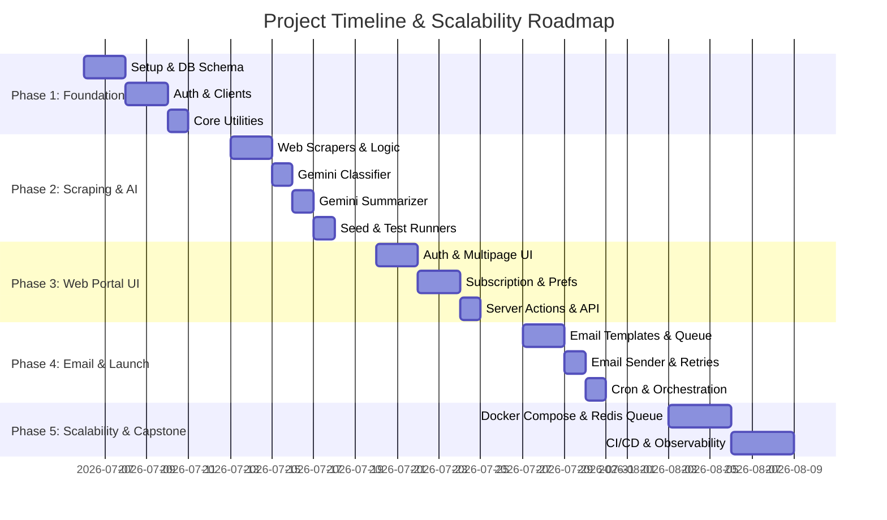
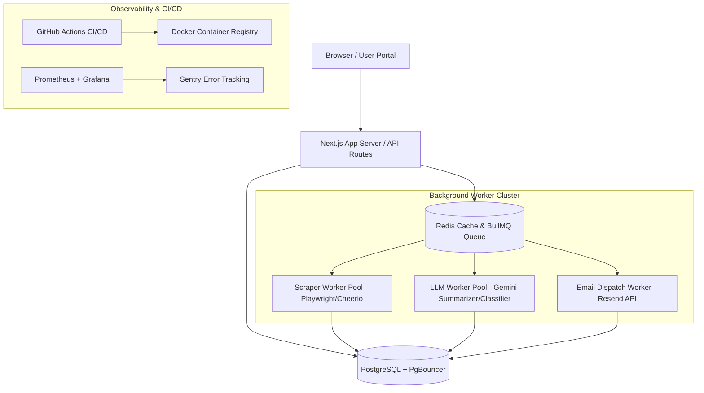

# 📅 AI News Digest - Sprint Roadmap & Scalable Capstone Architecture

This document outlines the implementation plan, status checklist, and the capstone scaling architecture (Docker, Redis/BullMQ, CI/CD, Observability, PgBouncer).

---

## 📊 High-Level Phases

| Phase | Focus | Scope & Architecture | Status |
|---|---|---|:---:|
| **Phase 1** | **Foundation & Infrastructure** | Setup, Prisma Schema, Supabase Auth, Service Clients, Core Utilities. | `[x] Completed` |
| **Phase 2** | **Data Ingestion & AI Agents** | RSS/HTML Scrapers, Content Deduping, Gemini Classification & Summarization. | `[x] Completed` |
| **Phase 3** | **Web Portal & Core Actions** | Dark Glassmorphic Portal, Subscriptions, History, Preferences, Lucide Icons. | `[x] Completed` |
| **Phase 4** | **Emailing, Cron & Processing** | React Email templates, Email Queue, Resend dispatch, Cron scheduler routes. | `[/] In Progress` |
| **Phase 5** | **Scalability & Capstone** | Docker Compose, Redis + BullMQ task queues, GitHub Actions CI/CD, Prometheus/Grafana, PgBouncer. | `[ ] Planned` |

---

## 🏗️ Capstone Scalability & Engineering Stack

### Key Engineering Architecture Requirements

1. **Docker & Multi-Container Docker Compose**:
   - Containers: `web` (Next.js), `redis` (Cache & Queue), `worker-scraper`, `worker-llm`, `postgres`.
   - Production Dockerfile with multi-stage build optimization.

2. **Redis + BullMQ Distributed Task Queue**:
   - Decouple heavy web scraping and Gemini LLM summarization from HTTP server threads.
   - Redis distributed locking (`Redlock`) to prevent duplicate scraping or duplicate email dispatches.
   - Exponential backoff retries and Dead-Letter Queues (DLQ).

3. **Database Connection Pooling (PgBouncer)**:
   - Efficient connection pooling for high-throughput concurrent user traffic.

4. **CI/CD Pipeline (GitHub Actions)**:
   - Automated testing on every push (`Jest`, `Playwright` E2E).
   - Automated Docker image build and registry pushing (`GHCR` / `ECR`).

5. **Observability & Monitoring**:
   - Prometheus metrics exporter & Grafana monitoring dashboards (queue depth, Gemini API latency, email delivery success rates).
   - Sentry error logging integration.

---

## 📈 Daily Progress Logging

| Day | Focus | Target Deliverables | Status | Updated On |
|---|---|---|:---:|---|
| **Day 1** | Configuration | Next.js 14 set up; dependency configurations matching. | `[x]` | 2026-07-24 |
| **Day 2** | DB Setup | Prisma Schema created; tables pushed and RLS rules active on PostgreSQL. | `[x]` | 2026-07-24 |
| **Day 3** | Auth Logic | Sign up/login flows connected; middlewares verified. | `[x]` | 2026-07-24 |
| **Day 4** | API Clients | Clients set up (Supabase, Gemini, Redis, Resend). | `[x]` | 2026-07-24 |
| **Day 5** | Utilities | Rates, errors, hash, logger utility functions ready. | `[x]` | 2026-07-24 |
| **Day 6** | Scrapers | Feed parser and Puppeteer scrapers fully implemented. | `[x]` | 2026-07-24 |
| **Day 7** | Ingestion | Scraper Agent operational; dedupes content using hashing. | `[x]` | 2026-07-24 |
| **Day 8** | Classify | Classifier Agent parses articles into DB with Gemini metadata. | `[x]` | 2026-07-24 |
| **Day 9** | Summarize | Summarizer Agent generates 3-tier summaries. | `[x]` | 2026-07-24 |
| **Day 10**| Run Tools | Seeding script done; `test-agents.js` runs successfully. | `[x]` | 2026-07-24 |
| **Day 11**| Portal Pages | Landing and Authentication routes styled in dark cyber theme. | `[x]` | 2026-07-24 |
| **Day 12**| Layout | Main layout shell and stats widget deployed with Lucide icons. | `[x]` | 2026-07-24 |
| **Day 13**| Prefs Form | Subscription checklists and validation schema loaded. | `[x]` | 2026-07-24 |
| **Day 14**| History UI | Past digests grid viewer and analytical tracker active. | `[x]` | 2026-07-24 |
| **Day 15**| API Actions | Mutations and REST APIs protected with API middleware. | `[x]` | 2026-07-24 |
| **Day 16**| Email CSS | React email UI templates designed. | `[/]` | 2026-07-24 |
| **Day 17**| Digest Agent | Generator queries DB, renders HTML, inserts into queue. | `[ ]` | - |
| **Day 18**| Email Agent | Queue scanner dispatches emails via Resend with retries. | `[ ]` | - |
| **Day 19**| Schedulers | Vercel Cron endpoints secure; QStash config verified. | `[ ]` | - |
| **Day 20**| Production | Dockerfile, CI/CD Actions, and Vercel hosting launched. | `[ ]` | - |
| **Day 21**| Docker Compose | Multi-container Docker Compose setup for Web, Redis, Workers. | `[ ]` | - |
| **Day 22**| Redis Queues | BullMQ task queue integration for distributed scraping & LLMs. | `[ ]` | - |
| **Day 23**| CI/CD Setup | GitHub Actions pipeline for testing, linting, and image builds. | `[ ]` | - |
| **Day 24**| Observability | Grafana dashboards, Prometheus metrics, and Sentry tracking. | `[ ]` | - |
